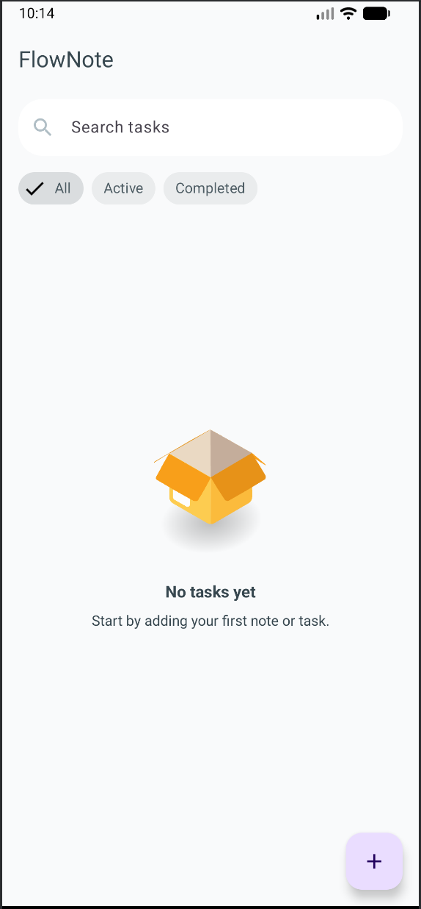
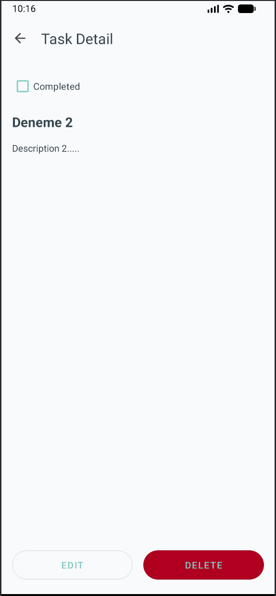
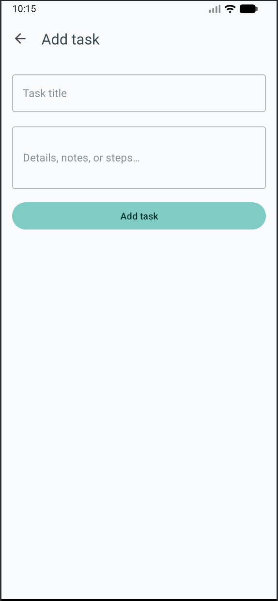
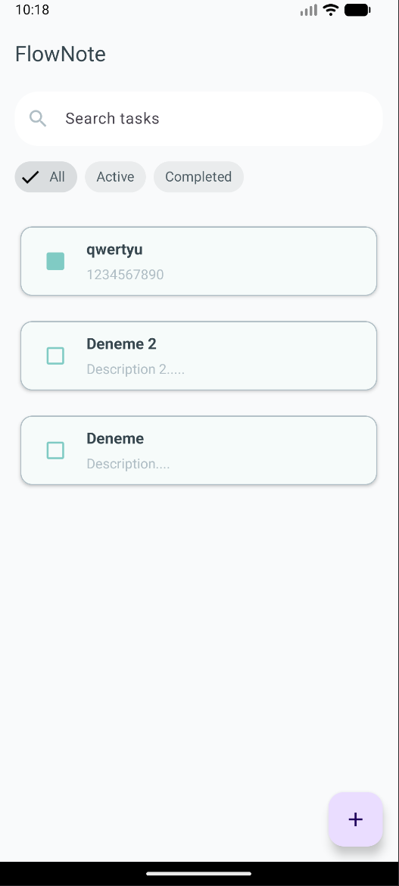
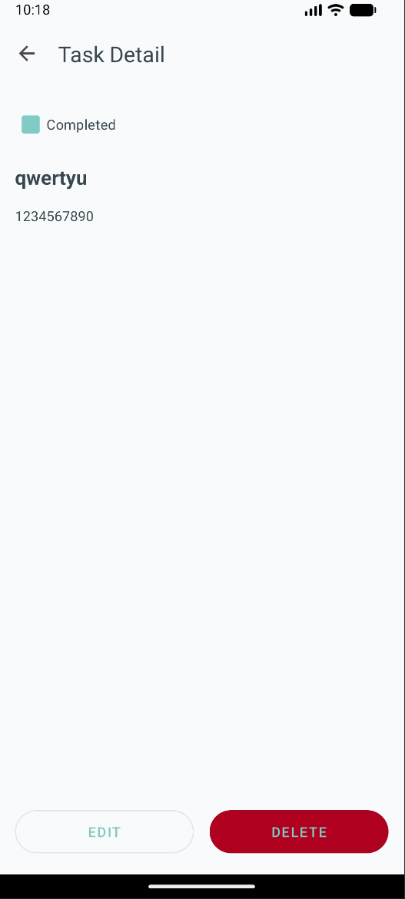
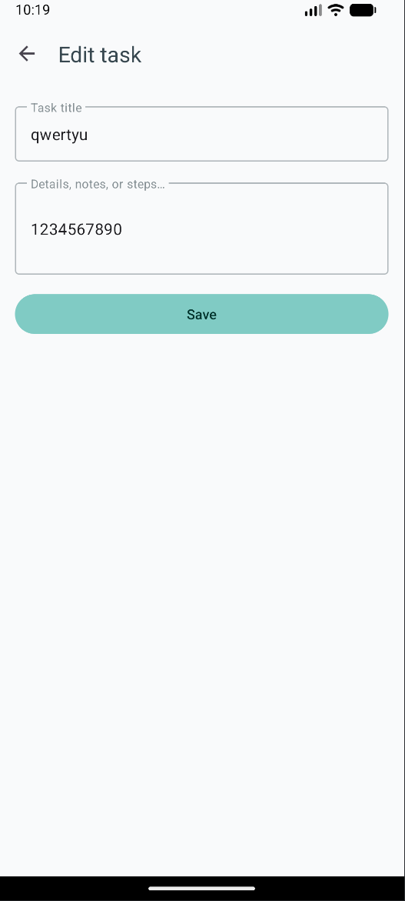

# 📝 FlowNote – Modern Task Management Case Study

[](https://kotlinlang.org/)
[](#)
[](#)
[](#)

**FlowNote** is a high-performance task and notes management application built to demonstrate modern
Android development standards. It focuses on clean code, scalability, and a robust architectural
foundation using **Clean Architecture** and **MVVM**.

---

## 🚀 Key Features

* **Reactive Data Flow:** Real-time synchronization with `Room` database using `Kotlin Flow`.
* **Advanced Search & Filtering:** Optimized `case-insensitive` search at the SQLite level and
  instant filtering by task status (All/Active/Completed).
* **Unified State Management:** Centralized handling of Loading, Success, Error, and Empty states
  using the `ViewState` pattern.
* **Modern UI/UX:** Material 3 components, smooth Lottie animations for empty states, and full
  Light/Dark mode support.
* **Type-Safe Navigation:** Secure data passing between fragments using `Jetpack Navigation` and
  `Safe Args`.

---

## 🏗️ Architectural Stack

The project follows the **Clean Architecture** principles, strictly decoupling business logic from
UI and data sources:

### 1. Domain Layer (Pure Kotlin)

* **Entities:** Core business models (`Task`, `FilterType`).
* **Use Cases:** Isolated business logic for each operation (`GetTasksUseCase`, `DeleteTaskUseCase`,
  etc.) following the **Single Responsibility Principle**.
* **Repository Interfaces:** Abstractions to keep the domain layer independent of data
  implementations.

### 2. Data Layer

* **Room Database:** Local persistence implementation.
* **Repository Implementation:** Management of data logic and mapping.
* **Mappers:** Converters between `Data Entities` and `Domain Models`.

### 3. Presentation Layer (MVVM)

* **ViewModel:** Managing UI State and interacting with Use Cases.
* **State & Events:** `StateFlow` for persistent UI state and `SharedFlow` for one-time UI events (
  Navigation, Toasts).
* **Data Binding:** Two-way binding between XML layouts and ViewModels for cleaner Fragments.

---

## 🛠️ Tech Stack

| Category                 | Technologies                                |
|:-------------------------|:--------------------------------------------|
| **Language**             | Kotlin + Coroutines & Flow                  |
| **Dependency Injection** | Hilt                                        |
| **Jetpack Components**   | Navigation, ViewModel, Room, Data Binding   |
| **UI**                   | Material 3, Lottie, ConstraintLayout        |
| **Architecture**         | Clean Architecture, MVVM, ViewState Pattern |

---

## 🔧 Technical Deep Dive

* **Reactive Search:** Implemented using `combine` and `flatMapLatest` operators to ensure search
  and filter changes are processed efficiently without blocking the main thread.
* **Error Handling:** Database operations are wrapped in a custom `Result` sealed class, ensuring
  that exceptions are caught at the data layer and handled gracefully in the UI.
* **List Optimization:** Used `ListAdapter` with `DiffUtil` to ensure only modified items are
  re-rendered, providing a buttery-smooth scrolling experience.

---

## 📸 Screenshots

|       Task List        |      Task Detail       |     Add/Edit Task      |
|:----------------------:|:----------------------:|:----------------------:|
|  |  |  |
|  |  |  |

---

## 🏁 Getting Started

1. Clone the repository:
   ```bash
   git clone (https://github.com/doseyenc/flownote.git)
   ```
2. Open the project in **Android Studio**.
3. Wait for the Gradle sync to complete.
4. Run the application on an emulator or physical device (Min SDK 24).

---

